# Burp WP a.k.a. WordPress Scanner


Find known vulnerabilities in WordPress plugins and themes using Burp Suite proxy.

**TL;DR: [WPScan](https://wpscan.org/) like plugin for [Burp](https://portswigger.net/) by [Kacper Szurek](https://security.szurek.pl/)**.

# Usage
[Install](#installation) extension. Browse WordPress sites through Burp proxy. Vulnerable plugins and themes will appear on the issue list.

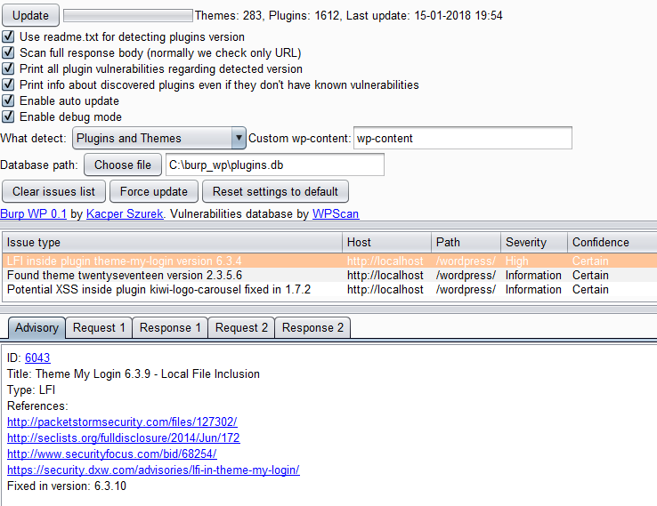

If you have Burp Pro, issues will also appear inside *Scanner* tab. Interesting things will be highlighted.

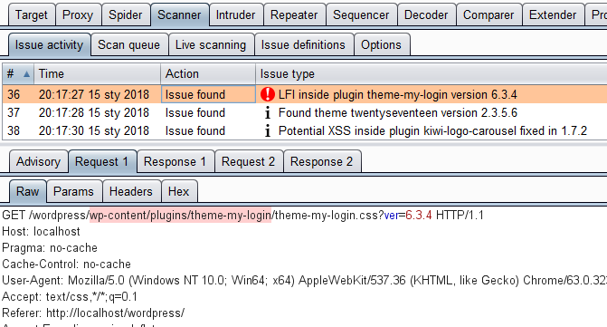


# Table of contents

* [Usage](#usage)
* [Installation](#installation)
* [Issue type](#issue-type)
* [Options](#options)
* [Offline database](#offline-database)
* [Intruder payload generator](#intruder-payload-generator)
* [License](#license)
* [Changelog](#changelog)

# Installation

WordPress Scanner is available inside [BApp Store](https://portswigger.net/bappstore).
  1. Inside Burp go to **Extender->BApp Store**
  2. Choose WordPress Scanner

  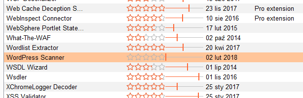
  3. Click **Install button**

  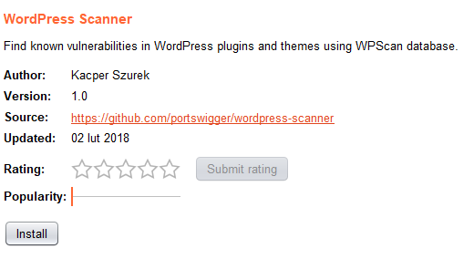

You can also install Burp WP manually:

  1. Download [Jython](http://www.jython.org/downloads.html) standalone JAR, for example version [2.7](http://search.maven.org/remotecontent?filepath=org/python/jython-standalone/2.7.0/jython-standalone-2.7.0.jar)
  2. Go to **Extender->Options**. Set path inside `Location of Jython standalone JAR file`

  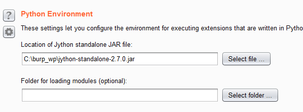

  3. Download [newest Burp WP](https://raw.githubusercontent.com/kacperszurek/burp_wp/master/burp_wp.py)
  4. Go to **Extender->Extensions**. Click **Add**. Set `Extension type` to `Python`. Set path inside `Extension file`.

  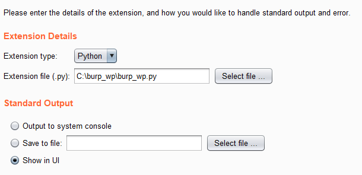

  5. Burp WP should appear inside `Burp Extensions list`. Also you will see new tab.

  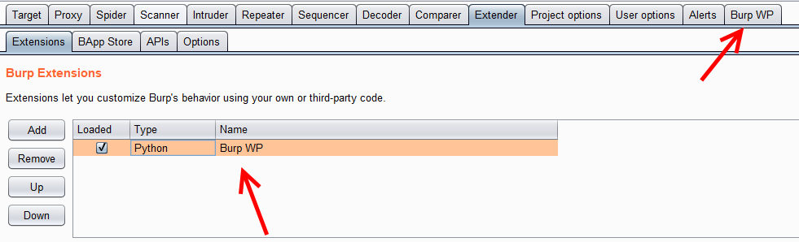

# Issue type

There are 3 types:

1. Default type (always enabled)
  ```
  {issue_type} inside {(plugin|theme)} {plugin_name} version {detected_version}
  ```

  It has `High severity`. If version is detected using `readme.txt`, `Certain confidence` is set. Otherwise we use `Firm confidence`.

2. Plugin vulnerabilities regarding detected version (option 4 enabled)
  ```
  Potential {issue_type} inside {(plugin|theme)} {plugin_name} fixed in {version_number}
  ```

  It has `Information severity` and `Certain confidence`.

3. Print info about discovered plugins (option 5 enabled)
  ```
  Found {(plugin|theme)} {plugin_name}
  ```

  or if plugin version is detected:

  ```
  Found {(plugin|theme)} {plugin_name} version {detected_version}
  ```

  It has `Information severity` and `Certain confidence` if is detected. Otherwise `Firm confidence` is used.

# Options

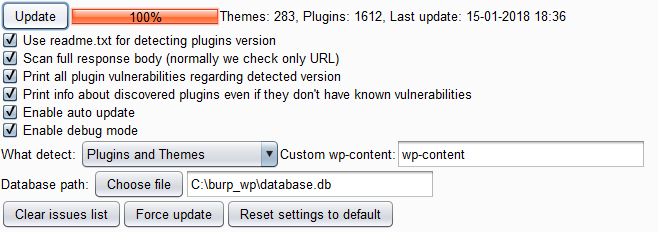

1. Update button

  List of vulnerable plugins and themes is downloaded from [WPscan](https://wpscan.org/). Before downloading, `sha512` of files is being checked to see if there is a new version available.

  This button also checks if new [Burp WP version exist](https://raw.githubusercontent.com/kacperszurek/burp_wp/master/version.sig) and allows simple auto update mechanism.

2. Use readme.txt for detecting plugins version

  Sometimes it's possible to detect plugin version through its resource because some of them have `?ver=` string.

  For example:

  ```
  http://www.example.com/wp-content/plugins/contact-form-7/includes/css/styles.css?ver=4.9.2
  ```

  Version can be checked using simple regular expression:

  ```
  re.compile("ver=([0-9\.]+)", re.IGNORECASE)
  ```

  But this approach is very *buggy*. Instead  more advanced heuristics are used.

  Most plugins contains `readme.txt` file:

  ```
  === Plugin Name ===
  Donate link: http://example.com/
  Stable tag: 4.3

  Here is a short description of the plugin.

  == Changelog ==

  = 1.0 =
  * A change since the previous version.
  ```

  So current plugin version can be obtained from `Stable tag` or `Changelog`.

  This idea is from [WPScan versionable.rb](https://github.com/wpscanteam/wpscan/blob/master/lib/common/models/wp_item/versionable.rb).

3. Scan full response body

  By default only request URL is used for finding plugins and themes.

  This works just fine but in some cases you may want to parse full response body. Use with caution as this might be slow.

4. Print all plugin vulnerabilities regarding detected version

  By default issue is only added when vulnerable plugin version is detected `plugin_version < fixed_version`.

  If you want to print all known vulnerabilities for detected plugin regarding its version - use this option.

5. Print info about discovered plugins even if they don't have known vulnerabilities

  Normally plugins/themes which are not vulnerable are ignored.

  If you want to have information about installed plugins on given website, even if they are not vulnerable - use this option.

6. Enable auto update

  Auto update database once per 24 h.

  It also checks if new Burp WP version exists.

7. Enable debug mode

  For development purpose.

  You can see output inside: **Extender->Extensions->Burp WP->Output tab**

  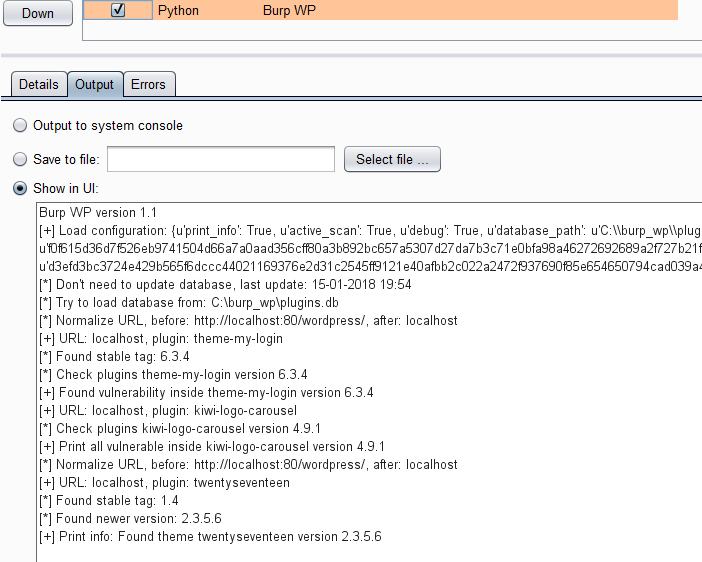

8. What detect

  Decide if you want to search for vulnerable plugins, themes or both.

9. Custom wp-content

  Detection mechanism is based on `wp-content` string.

  But it can be [changed](https://codex.wordpress.org/Editing_wp-config.php#Moving_wp-content_folder) by website owner. Here you can customize this option.

10. Clear issues list button

  This button will remove all issues from issues list inside extension tab.

11. Force update button

  Similar to `Update button` but it downloads new database even if newest one is already installed.

12. Reset settings to default

  Restore extension state to factory defaults.

# Offline database
  All vulnerabilities are provided by [WPscan](https://wpscan.org/) - see [Vulnerability Database](https://wpvulndb.com).

  Burp WP supports offline mode.

  If you operate from high-security network without Internet access you can easily copy database file from normal Burp WP instance to your offline one.

  Then use `Choose file` option.

  If it's valid Burp WP database it will be imported automatically.

# Intruder payload generator
  Because proxy requests and responses are used it's not possible to discover all plugins and themes installed on a specific website.

  You can try to get more information manually using intruder payload generator.

  Right click on URL inside **Proxy->HTTP history** and choose **Send to Burp WP Intruder**. 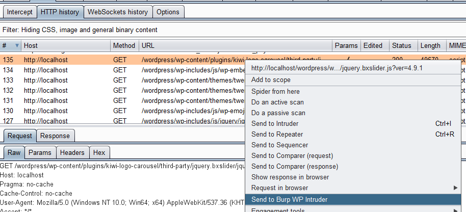

  This will replace request method to GET, remove all parameters and set payload position marker.

  Now go to **Intruder->Tab X->Positions**. Correct URL so it points to WordPress homepage.

  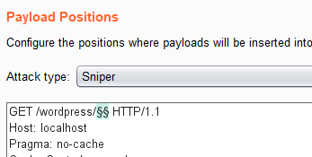

  Inside **Payloads** tab uncheck **Payload encoding** so `/` won't be converted to `%2f`.

  Then set **Payload type** to **Extension generated**. Now click **Select generator**:

  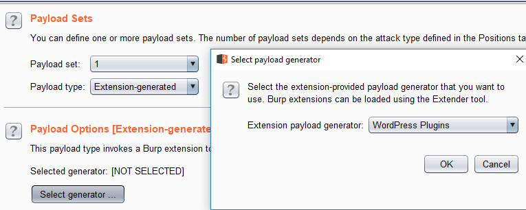

  There are 3 generators:
  1. WordPress Plugins
  2. WordPress Themes
  3. WordPress Plugins and themes


  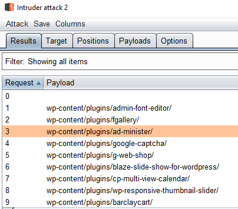

# License
  MIT License

  Copyright (c) 2018 Kacper Szurek

  Permission is hereby granted, free of charge, to any person obtaining a copy
  of this software and associated documentation files (the "Software"), to deal
  in the Software without restriction, including without limitation the rights
  to use, copy, modify, merge, publish, distribute, sublicense, and/or sell
  copies of the Software, and to permit persons to whom the Software is
  furnished to do so, subject to the following conditions:

  The above copyright notice and this permission notice shall be included in all
  copies or substantial portions of the Software.

  THE SOFTWARE IS PROVIDED "AS IS", WITHOUT WARRANTY OF ANY KIND, EXPRESS OR
  IMPLIED, INCLUDING BUT NOT LIMITED TO THE WARRANTIES OF MERCHANTABILITY,
  FITNESS FOR A PARTICULAR PURPOSE AND NONINFRINGEMENT. IN NO EVENT SHALL THE
  AUTHORS OR COPYRIGHT HOLDERS BE LIABLE FOR ANY CLAIM, DAMAGES OR OTHER
  LIABILITY, WHETHER IN AN ACTION OF CONTRACT, TORT OR OTHERWISE, ARISING FROM,
  OUT OF OR IN CONNECTION WITH THE SOFTWARE OR THE USE OR OTHER DEALINGS IN THE
  SOFTWARE.

  The WPScan data is licensed separately. Please find the WPScan license [here](https://raw.githubusercontent.com/wpscanteam/wpscan/master/LICENSE).

# Changelog

* 0.1.1 - Updates are downloaded through Burp proxy, fix clear list issues button, implement doPassiveScan function
* 0.1 - Beta version
